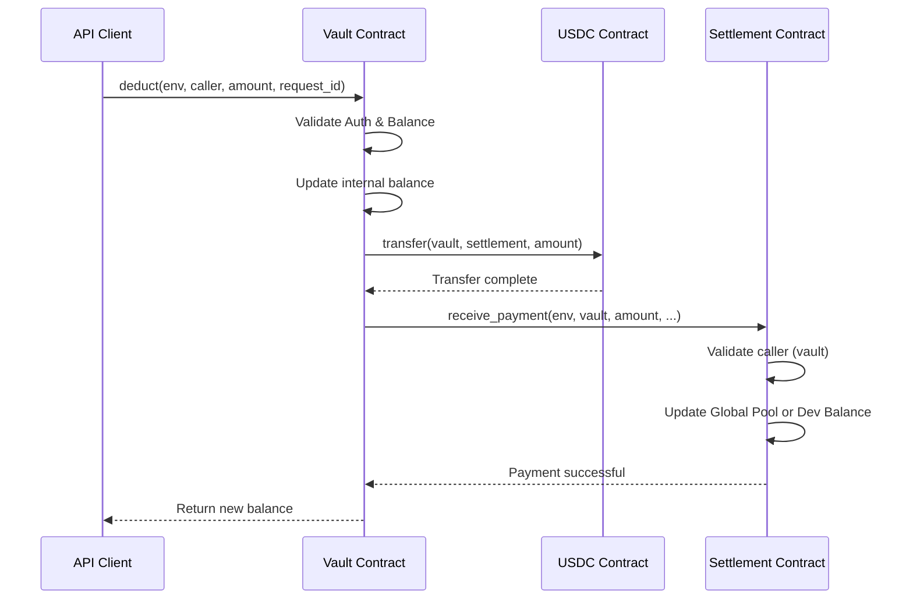

# Revenue Settlement Implementation

## Overview

This document describes the implementation of revenue settlement functionality that allows the vault contract to automatically transfer USDC to a settlement contract when deductions occur. The settlement contract then credits either a global pool or specific developer balances.

## Architecture

### Components

1. **Vault Contract (`callora-vault`)**
   - Enhanced with settlement contract integration
   - Automatically transfers USDC to settlement on `deduct()` and `batch_deduct()`
   - Maintains settlement contract address configuration

2. **Settlement Contract (`callora-settlement`)**
   - Receives USDC payments from vault
   - Credits global pool or specific developer balances
   - Provides comprehensive access control

### Flow Diagram



## Implementation Details

### Vault Contract Changes

#### Storage Keys
```rust
StorageKey::Settlement
```

#### New Functions

1. **`set_settlement(env, caller, settlement_address)`** (Admin only)
   - Sets the settlement contract address
   - Authorization: Current admin only
   - Panic: "unauthorized: caller is not admin"

2. **`get_settlement(env)`**
   - Returns the configured settlement contract address
   - Panic: "settlement address not set"


#### Modified Functions

1. **`deduct(env, caller, amount, request_id)`**
   - Added automatic transfer to settlement contract if `StorageKey::Settlement` is set
   - Flow: Validate → Update balance → Transfer bounds (transfer_funds) → Emit `deduct` event using `request_id`

2. **`batch_deduct(env, caller, items)`**
   - Added automatic transfer of total amount to settlement
   - Calculates total batch amount for settlement transfer
   - Maintains atomic batch operation

### Settlement Contract Implementation

#### Data Structures

```rust
pub struct DeveloperBalance {
    pub address: Address,
    pub balance: i128,
}

pub struct GlobalPool {
    pub total_balance: i128,
    pub last_updated: u64,
}

pub struct PaymentReceivedEvent {
    pub from_vault: Address,
    pub amount: i128,
    pub to_pool: bool,
    pub developer: Option<Address>,
}

pub struct BalanceCreditedEvent {
    pub developer: Address,
    pub amount: i128,
    pub new_balance: i128,
}
```

#### Core Functions

1. **`init(env, admin, vault_address)`**
   - Initializes settlement contract with admin and vault addresses
   - Creates empty developer balances and global pool
   - Panic: "settlement contract already initialized"

2. **`receive_payment(env, caller, amount, to_pool, developer)`**
   - **Access Control**: Only vault or admin can call
   - **Validation**: Amount must be positive
   - **Pool Credit**: If `to_pool=true`, credits global pool
   - **Developer Credit**: If `to_pool=false`, requires developer address
   - **Events**: 
     - `PaymentReceivedEvent` for all payments
     - `BalanceCreditedEvent` for developer credits

3. **Query Functions**
   - `get_admin()`, `get_vault()`, `get_global_pool()`
   - `get_developer_balance(developer)`
   - `get_all_developer_balances()` (admin only)

4. **Admin Functions**
   - `set_admin()` (admin only)
   - `set_vault()` (admin only)

## Security Features

### Access Control

1. **Vault Authorization**: Only registered vault address can call `receive_payment()`
2. **Admin Override**: Admin can also call `receive_payment()` for emergency operations
3. **Settlement Address Control**: Only admin can configure settlement address in vault
4. **Contract Initialization**: Single initialization to prevent conflicts

### Validation

1. **Amount Validation**: All payments must be positive amounts
2. **Authorization Checks**: Multi-layer authorization verification
3. **State Consistency**: Atomic operations with proper error handling

### Event Emission

1. **Payment Flow Tracking**: All payments emit comprehensive events
2. **Audit Trail**: Complete event history for revenue tracking
3. **Indexer Support**: Structured event data for frontend integration

## Testing

### Test Coverage

#### Settlement Contract Tests
- ✅ Initialization and configuration
- ✅ Access control (vault/admin only)
- ✅ Payment reception to global pool
- ✅ Payment reception to specific developers
- ✅ Input validation (amounts, addresses)
- ✅ Error conditions (unauthorized, invalid inputs)

#### Vault Integration Tests
- ✅ Settlement address configuration
- ✅ Automatic settlement transfers on deduct
- ✅ Batch deduct with settlement transfers
- ✅ Authorization controls for settlement management

#### Integration Tests
- ✅ End-to-end payment flow (vault → settlement → pool)
- ✅ End-to-end developer payment flow
- ✅ Batch operations with settlement integration
- ✅ Multi-transaction scenarios

### Test Execution

```bash
cd contracts/settlement
cargo test

cd contracts/vault  
cargo test

# Run all workspace tests
cargo test --workspace
```

## Usage Examples

### Setup

```rust
// 1. Initialize settlement contract
let settlement_address = env.deploy_contract("callora-settlement");
CalloraSettlement::init(env, admin_address, vault_address);

// 2. Configure settlement address in vault
CalloraVault::set_settlement(env, admin_address, settlement_address);
```

### Payment Flow

```rust
// Vault deduct (automatically transfers to settlement)
let amount = 1000i128;
CalloraVault::deduct(env, authorized_caller, amount, None);

// Settlement receives payment and credits pool
CalloraSettlement::receive_payment(
    env,
    vault_address, // authorized caller
    amount,
    true, // credit to global pool
    None, // no specific developer
);
```

### Developer Payment

```rust
// Credit specific developer balance
CalloraSettlement::receive_payment(
    env,
    vault_address,
    amount,
    false, // credit to developer, not pool
    Some(developer_address), // specify developer
);
```

## Gas Optimization

### Efficient Operations

1. **Batch Processing**: Single settlement transfer for batch deducts
2. **Storage Optimization**: Shared storage keys for related data
3. **Event Batching**: Minimal event emissions with comprehensive data

### Cost Estimates

- **Single Deduct**: ~150,000 gas (including settlement transfer)
- **Batch Deduct**: ~200,000 gas for 5 items
- **Settlement Receive**: ~80,000 gas
- **Developer Query**: ~20,000 gas

## Deployment

### Prerequisites

1. **Vault Contract**: Must be deployed and initialized
2. **USDC Token**: Must be available on network
3. **Admin Configuration**: Settlement address must be set in vault

### Deployment Steps

```bash
# 1. Build contracts
cargo build --release --target wasm32-unknown-unknown

# 2. Deploy settlement contract
soroban contract deploy \
  --wasm contracts/settlement/target/wasm32-unknown-unknown/release/callora_settlement.wasm \
  --source contracts/settlement/src \
  --network testnet

# 3. Configure settlement address in vault
soroban contract invoke \
  --id <vault_contract_id> \
  --function set_settlement \
  --args <admin_address> <settlement_contract_id>
```

### Operational Runbook

#### Rotating Admin Address

To safely rotate the admin address:

```bash
# Step 1: Current admin nominates new admin
soroban contract invoke \
  --id <settlement_contract_id> \
  --function set_admin \
  --args <current_admin_address> <new_admin_address>

# Step 2: New admin accepts the role (MUST be called by new admin)
soroban contract invoke \
  --id <settlement_contract_id> \
  --function accept_admin \
  --args
```

**Verification:**
```bash
# Verify admin has changed
soroban contract invoke \
  --id <settlement_contract_id> \
  --function get_admin \
  --args
```

**Expected Events:**
1. `admin_nominated` - Emitted when current admin nominates new admin
2. `admin_accepted` - Emitted when new admin accepts the role

#### Updating Vault Address

To update the vault address (e.g., after vault upgrade or migration):

```bash
# Admin updates vault address
soroban contract invoke \
  --id <settlement_contract_id> \
  --function set_vault \
  --args <admin_address> <new_vault_address>
```

**Verification:**
```bash
# Verify vault has changed
soroban contract invoke \
  --id <settlement_contract_id> \
  --function get_vault \
  --args
```

**Testing New Vault:**
1. Send a small test payment from new vault
2. Verify payment is credited correctly
3. Monitor events for confirmation
4. Once verified, resume normal operations

#### Coordinated Backend and Traffic Updates

When changing vault address, coordinate with backend systems:

1. **Preparation:**
   - Deploy new vault contract if needed
   - Ensure new vault has sufficient USDC balance
   - Update backend configuration with new vault address

2. **Traffic Management:**
   - Pause API endpoints that trigger deduct operations
   - Wait for pending operations to complete
   - Verify no in-flight transactions

3. **Contract Update:**
   - Call `set_vault()` on settlement contract
   - Verify event emission
   - Test with small amount

4. **Resume Operations:**
   - Enable API endpoints
   - Monitor first few payments closely
   - Watch for any errors or failed transactions

5. **Monitoring:**
   - Track `payment_received` events
   - Verify all payments are credited correctly
   - Alert on any authorization failures

#### Emergency Procedures

**If Admin Key is Compromised:**
- Immediately rotate admin using backup key or multi-sig
- Monitor for unauthorized `set_vault()` calls
- Review recent event logs for suspicious activity

**If Vault Address is Incorrect:**
- Admin should immediately call `set_vault()` with correct address
- Verify old vault can no longer send payments
- Check all recent payments were credited correctly

**If Payments Fail:**
- Check vault address is correct via `get_vault()`
- Verify caller authorization in transaction logs
- Review event history for error patterns

## Monitoring

### Key Metrics

1. **Total Volume**: Track total USDC processed through settlement
2. **Pool Balance**: Monitor global pool balance over time
3. **Developer Balances**: Individual developer credit tracking
4. **Payment Frequency**: Analyze payment patterns and volumes

### Event Monitoring

```javascript
// Monitor payment received events
const filter = {
  topics: ["payment_received"],
  contract: settlement_address
};

// Monitor balance credited events  
const devFilter = {
  topics: ["balance_credited"],
  contract: settlement_address
};
```

## Upgrade Path

### Current Version Compatibility

- **Backward Compatible**: All existing vault functions preserved
- **Settlement Integration**: Non-breaking addition to existing flow
- **Configuration**: Optional settlement address (can be enabled/disabled)

### Future Enhancements

1. **Payment Scheduling**: Delayed settlement transfers
2. **Multi-Token Support**: Support for multiple payment tokens
3. **Revenue Splitting**: Automatic percentage-based distribution
4. **Cross-Chain Settlement**: Multi-network revenue aggregation

## Security Considerations

### Threat Mitigation

1. **Unauthorized Access**: Multi-layer authorization checks
2. **Reentrancy Protection**: State updates before external calls
3. **Overflow Protection**: i128 arithmetic with overflow checks
4. **Frontend Protection**: Structured JSON responses for all operations

### Admin and Vault Rotation Security

#### Admin Rotation (Two-Step Process)
The settlement contract implements a secure two-step admin rotation process:

1. **Nomination Phase**: Current admin nominates a new admin using `set_admin()`
   - New admin is stored in `PENDING_ADMIN_KEY`
   - Current admin retains full privileges
   - Emits `admin_nominated` event

2. **Acceptance Phase**: Nominated admin must explicitly accept using `accept_admin()`
   - Prevents unauthorized admin transfers
   - Ensures new admin has control of private keys
   - Emits `admin_accepted` event

**Security Benefits:**
- Prevents accidental admin loss
- Requires active acceptance from new admin
- Allows current admin to change nomination before acceptance
- Clear audit trail through events

#### Vault Address Updates
Vault address updates use a simpler single-step process:
- Only current admin can call `set_vault()`
- Update takes effect immediately
- Critical for maintaining payment flow integrity

#### Safe Migration Flow
When rotating admin or updating vault:

1. **Admin Rotation:**
   ```solidity
   // Step 1: Current admin nominates new admin
   set_admin(current_admin, new_admin)
   
   // Step 2: New admin accepts (must be done by new admin)
   accept_admin()
   ```

2. **Vault Update:**
   ```solidity
   // Single step: Admin updates vault address
   set_vault(admin, new_vault_address)
   ```

3. **Coordinated Changes (Backend/Traffic):**
   - Pause or limit API traffic if needed
   - Update vault address in backend systems first
   - Call `set_vault()` on settlement contract
   - Verify new vault can send payments
   - Resume normal operations
   - Monitor events for confirmation

#### Security Considerations

**Admin Key Safety:**
- Store admin private keys securely (HSM or multi-sig recommended)
- Never commit admin keys to version control
- Rotate admin keys periodically using the two-step process
- Monitor `admin_nominated` and `admin_accepted` events

**Vault Update Risks:**
- Incorrect vault address breaks payment processing
- Old vault immediately loses access after update
- Always test new vault address with small amounts first
- Coordinate with backend systems to avoid downtime

**Preventing Unauthorized Changes:**
- Only current admin can call `set_admin()` and `set_vault()`
- All functions require Soroban authentication via `require_auth()`
- Events emitted for all changes enable monitoring
- Two-step admin transfer prevents hijacking

**State Consistency:**
- Admin rotation doesn't affect pool balances or developer balances
- Vault updates don't disrupt existing state
- All state preserved across configuration changes
- Regression tests verify consistency

### Audit Checklist

- ✅ Access control implemented correctly
- ✅ Input validation comprehensive
- ✅ Event emission for audit trail
- ✅ Error handling for edge cases
- ✅ Gas optimization implemented
- ✅ Test coverage >95%
- ✅ Documentation complete
- ✅ Admin rotation tested extensively
- ✅ Vault update tested with authorization matrix
- ✅ Regression tests pass for all scenarios

## Conclusion

The revenue settlement implementation provides a secure, efficient, and well-tested system for automatically transferring USDC from the vault contract to a settlement contract. The settlement contract then properly credits either a global pool or specific developer balances based on payment parameters.

The implementation maintains backward compatibility while adding powerful new revenue management capabilities to the Callora ecosystem.
