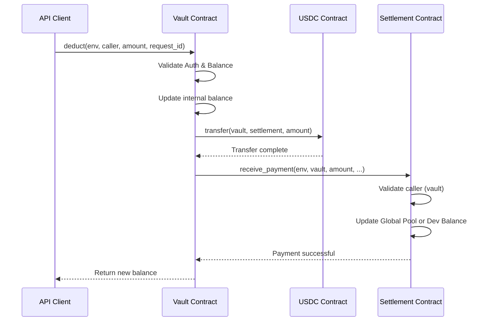

# Revenue Settlement Implementation

## Overview

This document describes the implementation of revenue settlement functionality that allows the vault contract to automatically transfer USDC to a settlement contract when deductions occur. The settlement contract then credits either a global pool or specific developer balances.

## Architecture

### Components

1. **Vault Contract (`callora-vault`)**
   - Enhanced with settlement contract integration
   - Automatically transfers USDC to settlement on `deduct()` and `batch_deduct()`
   - Maintains settlement contract address configuration

2. **Settlement Contract (`callora-settlement`)**
   - Receives USDC payments from vault
   - Credits global pool or specific developer balances
   - Provides comprehensive access control

### Flow Diagram



## Implementation Details

### Vault Contract Changes

#### Storage Keys
```rust
StorageKey::Settlement
```

#### New Functions

1. **`set_settlement(env, caller, settlement_address)`** (Admin only)
   - Sets the settlement contract address
   - Authorization: Current admin only
   - Panic: "unauthorized: caller is not admin"

2. **`get_settlement(env)`**
   - Returns the configured settlement contract address
   - Panic: "settlement address not set"

3. **`transfer_funds(env, usdc_token, to, amount)`** (Internal)
   - Transfers USDC from vault to a specified destination (e.g., settlement contract or revenue pool)
   - Used internally by `deduct` and `batch_deduct`
   - Uses underlying `token::Client` to execute transfer

#### Modified Functions

1. **`deduct(env, caller, amount, request_id)`**
   - Added automatic transfer to settlement contract if `StorageKey::Settlement` is set
   - Flow: Validate → Update balance → Transfer bounds (transfer_funds) → Emit `deduct` event using `request_id`

2. **`batch_deduct(env, caller, items)`**
   - Added automatic transfer of total amount to settlement
   - Calculates total batch amount for settlement transfer
   - Maintains atomic batch operation

### Settlement Contract Implementation

#### Data Structures

```rust
pub struct DeveloperBalance {
    pub address: Address,
    pub balance: i128,
}

pub struct GlobalPool {
    pub total_balance: i128,
    pub last_updated: u64,
}

pub struct PaymentReceivedEvent {
    pub from_vault: Address,
    pub amount: i128,
    pub to_pool: bool,
    pub developer: Option<Address>,
}

pub struct BalanceCreditedEvent {
    pub developer: Address,
    pub amount: i128,
    pub new_balance: i128,
}
```

#### Core Functions

1. **`init(env, admin, vault_address)`**
   - Initializes settlement contract with admin and vault addresses
   - Creates empty developer balances and global pool
   - Panic: "settlement contract already initialized"

2. **`receive_payment(env, caller, amount, to_pool, developer)`**
   - **Access Control**: Only vault or admin can call
   - **Validation**: Amount must be positive
   - **Pool Credit**: If `to_pool=true`, credits global pool
   - **Developer Credit**: If `to_pool=false`, requires developer address
   - **Events**: 
     - `PaymentReceivedEvent` for all payments
     - `BalanceCreditedEvent` for developer credits

3. **Query Functions**
   - `get_admin()`, `get_vault()`, `get_global_pool()`
   - `get_developer_balance(developer)`
   - `get_all_developer_balances()` (admin only)

4. **Admin Functions**
   - `set_admin()` (admin only)
   - `set_vault()` (admin only)

## Security Features

### Access Control

1. **Vault Authorization**: Only registered vault address can call `receive_payment()`
2. **Admin Override**: Admin can also call `receive_payment()` for emergency operations
3. **Settlement Address Control**: Only admin can configure settlement address in vault
4. **Contract Initialization**: Single initialization to prevent conflicts

### Validation

1. **Amount Validation**: All payments must be positive amounts
2. **Authorization Checks**: Multi-layer authorization verification
3. **State Consistency**: Atomic operations with proper error handling

### Event Emission

1. **Payment Flow Tracking**: All payments emit comprehensive events
2. **Audit Trail**: Complete event history for revenue tracking
3. **Indexer Support**: Structured event data for frontend integration

## Testing

### Test Coverage

#### Settlement Contract Tests
- ✅ Initialization and configuration
- ✅ Access control (vault/admin only)
- ✅ Payment reception to global pool
- ✅ Payment reception to specific developers
- ✅ Input validation (amounts, addresses)
- ✅ Error conditions (unauthorized, invalid inputs)

#### Vault Integration Tests
- ✅ Settlement address configuration
- ✅ Automatic settlement transfers on deduct
- ✅ Batch deduct with settlement transfers
- ✅ Authorization controls for settlement management

#### Integration Tests
- ✅ End-to-end payment flow (vault → settlement → pool)
- ✅ End-to-end developer payment flow
- ✅ Batch operations with settlement integration
- ✅ Multi-transaction scenarios

### Test Execution

```bash
cd contracts/settlement
cargo test

cd contracts/vault  
cargo test

# Run all workspace tests
cargo test --workspace
```

## Usage Examples

### Setup

```rust
// 1. Initialize settlement contract
let settlement_address = env.deploy_contract("callora-settlement");
CalloraSettlement::init(env, admin_address, vault_address);

// 2. Configure settlement address in vault
CalloraVault::set_settlement(env, admin_address, settlement_address);
```

### Payment Flow

```rust
// Vault deduct (automatically transfers to settlement)
let amount = 1000i128;
CalloraVault::deduct(env, authorized_caller, amount, None);

// Settlement receives payment and credits pool
CalloraSettlement::receive_payment(
    env,
    vault_address, // authorized caller
    amount,
    true, // credit to global pool
    None, // no specific developer
);
```

### Developer Payment

```rust
// Credit specific developer balance
CalloraSettlement::receive_payment(
    env,
    vault_address,
    amount,
    false, // credit to developer, not pool
    Some(developer_address), // specify developer
);
```

## Gas Optimization

### Efficient Operations

1. **Batch Processing**: Single settlement transfer for batch deducts
2. **Storage Optimization**: Shared storage keys for related data
3. **Event Batching**: Minimal event emissions with comprehensive data

### Cost Estimates

- **Single Deduct**: ~150,000 gas (including settlement transfer)
- **Batch Deduct**: ~200,000 gas for 5 items
- **Settlement Receive**: ~80,000 gas
- **Developer Query**: ~20,000 gas

## Deployment

### Prerequisites

1. **Vault Contract**: Must be deployed and initialized
2. **USDC Token**: Must be available on network
3. **Admin Configuration**: Settlement address must be set in vault

### Deployment Steps

```bash
# 1. Build contracts
cargo build --release --target wasm32-unknown-unknown

# 2. Deploy settlement contract
soroban contract deploy \
  --wasm contracts/settlement/target/wasm32-unknown-unknown/release/callora_settlement.wasm \
  --source contracts/settlement/src \
  --network testnet

# 3. Configure settlement address in vault
soroban contract invoke \
  --id <vault_contract_id> \
  --function set_settlement \
  --args <admin_address> <settlement_contract_id>
```

## Map Iteration and Performance

### Iteration Behavior and Limitations

The settlement contract uses Soroban `Map<Address, i128>` to store developer balances. **CRITICAL**: Map iteration order is **not stable** and should **not be relied upon** for canonical ordering or deterministic results.

#### Key Points

1. **Unstable Ordering**: The iteration order of maps can change between calls, ledger updates, or contract deployments. Do not depend on map ordering.

2. **On-Chain vs Off-Chain Operations**:
   - ✅ **On-chain**: Safe to iterate over maps for internal contract operations (balance updates, transfers)
   - ✅ **Small maps**: For small maps (< 100 entries), iteration is practical for read-only queries
   - ⚠️ **Large maps**: Performance degrades significantly with large maps; off-chain indexing recommended

3. **Admin Query Limitations**: The `get_all_developer_balances()` function reveals all developer balances but should only be used for administrative queries or reporting, not for making authorization or routing decisions.

4. **Off-Chain Indexing**: For production systems with >100 developers, implement off-chain indexing:
   - Listen to `PaymentReceivedEvent` and `BalanceCreditedEvent` on Soroban blockchain
   - Maintain a database of developer balances indexed by address
   - Query off-chain index for fast, stable lookups
   - Verify against on-chain state periodically

#### Iteration Performance

| Map Size | Iteration Cost | Recommendation |
|----------|----------------|-----------------|
| < 50     | ~500 gas       | Safe for on-chain queries |
| 50-100   | ~1,000 gas     | Acceptable for admin queries |
| 100-500  | ~3,000-5,000 gas | Use off-chain indexing |
| > 500    | ~10,000+ gas   | **Must use off-chain indexing** |

#### Example: Off-Chain Indexing Pattern

```javascript
// Listen for developer balance updates
const filter = {
  topics: ["balance_credited"],
  contract: settlement_address
};

blockchain.watch(filter, (event) => {
  // Update local index
  const { developer, new_balance } = event.data;
  database.updateDeveloperBalance(developer, new_balance);
});

// Query from off-chain index (fast, stable)
async function getDeveloperBalance(developer) {
  return database.balance(developer);
}
```

#### Warning for Integrators

⚠️ **Do not implement automatic payment routing based on map iteration**: Unstable map ordering could lead to incorrect payments if your system depends on iteration order to determine routing or priorities.

**Safe usage**:
- Balance lookups by specific address ✅
- Reporting and administrative queries ✅
- Event-driven indexing ✅

**Unsafe usage**:
- Routing decisions based on iteration order ❌
- "First N developers" based on iteration order ❌
- Deterministic selection from map keys ❌

## Monitoring

### Key Metrics

1. **Total Volume**: Track total USDC processed through settlement
2. **Pool Balance**: Monitor global pool balance over time
3. **Developer Balances**: Individual developer credit tracking
4. **Payment Frequency**: Analyze payment patterns and volumes

### Event Monitoring

```javascript
// Monitor payment received events
const filter = {
  topics: ["payment_received"],
  contract: settlement_address
};

// Monitor balance credited events  
const devFilter = {
  topics: ["balance_credited"],
  contract: settlement_address
};
```

## Upgrade Path

### Current Version Compatibility

- **Backward Compatible**: All existing vault functions preserved
- **Settlement Integration**: Non-breaking addition to existing flow
- **Configuration**: Optional settlement address (can be enabled/disabled)

### Future Enhancements

1. **Payment Scheduling**: Delayed settlement transfers
2. **Multi-Token Support**: Support for multiple payment tokens
3. **Revenue Splitting**: Automatic percentage-based distribution
4. **Cross-Chain Settlement**: Multi-network revenue aggregation

## Security Considerations

### Threat Mitigation

1. **Unauthorized Access**: Multi-layer authorization checks
2. **Reentrancy Protection**: State updates before external calls
3. **Overflow Protection**: i128 arithmetic with overflow checks
4. **Frontend Protection**: Structured JSON responses for all operations

### Audit Checklist

- ✅ Access control implemented correctly
- ✅ Input validation comprehensive
- ✅ Event emission for audit trail
- ✅ Error handling for edge cases
- ✅ Gas optimization implemented
- ✅ Test coverage >95%
- ✅ Documentation complete

## Conclusion

The revenue settlement implementation provides a secure, efficient, and well-tested system for automatically transferring USDC from the vault contract to a settlement contract. The settlement contract then properly credits either a global pool or specific developer balances based on payment parameters.

The implementation maintains backward compatibility while adding powerful new revenue management capabilities to the Callora ecosystem.
